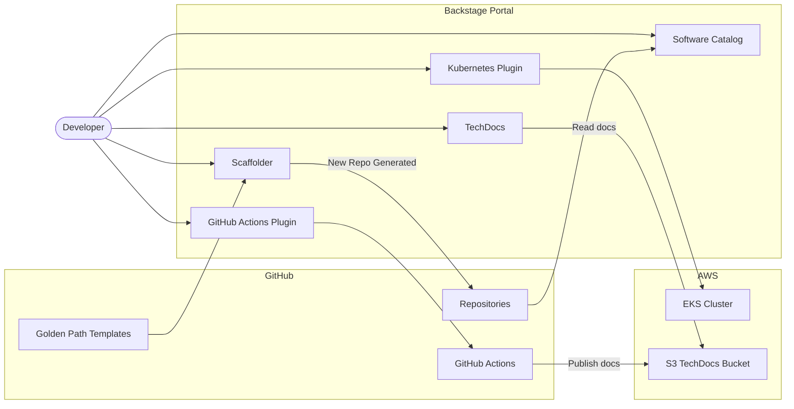

# Internal Developer Platform - Architecture Overview

The TCS IDP is a Backstage-based developer portal delivering service catalog, golden paths (scaffolder templates), TechDocs, and developer workflow integrations to engineering teams. It provides a single pane of glass for developers to discover services, create new ones from standardized templates, and access operational information without context-switching across tools.

## Architecture Diagram

## Core Capabilities

### Software Catalog

The software catalog is the central registry for all services, APIs, resources, and teams. Every deployed service must have a `catalog-info.yaml` in its repository. The catalog ingests this file automatically via GitHub discovery, providing a live view of the software ecosystem.

### Scaffolder (Golden Paths)

The scaffolder provides parameterized templates that generate new repositories pre-configured with CI/CD, Helm charts, TechDocs, and catalog registration. Teams use this instead of copying from example repos. Available golden paths:

- Node.js microservice (Express + GitHub Actions + Helm)
- Python microservice (FastAPI + GitHub Actions + Helm)

### TechDocs

TechDocs turns Markdown documentation committed alongside code into rendered, searchable HTML. Documentation is built by GitHub Actions (`techdocs-cli generate` + `techdocs-cli publish`) and stored in S3. Backstage reads from S3 at browse time. No documentation system separate from the repo is needed.

### Kubernetes Plugin

Shows live cluster state (deployments, pods, resource usage) directly on the catalog service page. Developers see their service's Kubernetes health without leaving Backstage. Configured to read from the TCS shared EKS cluster.

### GitHub Actions Plugin

Shows CI/CD pipeline status for the service's GitHub Actions workflows directly on the catalog page. Surfaces build and deploy status without navigating to GitHub.

## Integration Points

| Integration | Purpose | Status |
|-------------|---------|--------|
| GitHub | Source of truth for code and CI/CD | Configured |
| EKS | Kubernetes cluster visibility | Configured |
| AWS Cost | Cost attribution per service | Planned |
| PagerDuty | On-call integration | Optional |

## Getting Started

To create a new service using the golden path templates, see the [tcs-platform-blueprints](https://github.com/tata-consulting/tcs-platform-blueprints) repository. Templates are available for Node.js and Python services.

For catalog onboarding of existing services, see [Service Catalog Entity Design](./service-catalog-entities.md).
