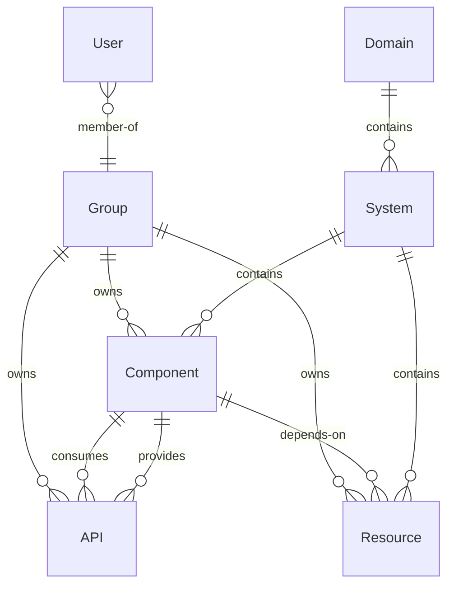

# Service Catalog Entity Design

This document defines the entity kinds, annotation standards, and naming conventions for the TCS Backstage service catalog.

## Entity Relationship Diagram



## Entity Kinds

### Component

Deployable services and libraries. This is the most common entity kind. Every microservice, frontend application, data pipeline, or shared library should have a `Component` entry.

**Subtypes (`spec.type`):** `service`, `library`, `website`, `pipeline`

### API

Machine-readable API specifications. Links to or embeds the API contract so consumers can discover and understand the interface without reading source code.

**Subtypes (`spec.type`):** `openapi`, `asyncapi`, `grpc`, `graphql`

API entities should reference the spec file via annotation rather than embedding the spec inline - see Required Annotations below.

### Resource

Managed infrastructure that services depend on. Represents external resources like databases, queues, and object storage that are not themselves deployable services.

**Subtypes (`spec.type`):** `database`, `s3-bucket`, `message-queue`, `cache`

### System

A logical grouping of related Components, APIs, and Resources that together form a product or capability. Systems provide a higher-level view than individual components.

### Domain

Business domain grouping for Systems. Maps to organizational or product domain boundaries.

### User / Group

Team and individual identity. Used for ownership and on-call assignment. Typically synchronized from the identity provider rather than managed manually.

## Required Annotations

All `Component` entities must include the following annotations. The golden path scaffolder templates pre-populate these automatically.

```yaml
apiVersion: backstage.io/v1alpha1
kind: Component
metadata:
  name: my-service                          # kebab-case, matches repo name
  description: "Short description of the service"
  annotations:
    # Source control - enables GitHub integration
    github.com/project-slug: tata-consulting/my-service

    # TechDocs - points to the docs directory
    backstage.io/techdocs-ref: dir:.

    # TCS custom annotations (all required)
    tcs.io/team: platform                   # owning team slug
    tcs.io/tier: tier-2                     # tier-1 | tier-2 | tier-3
    tcs.io/language: nodejs                 # nodejs | python | java | go | etc.
    tcs.io/lifecycle: production            # production | development | deprecated | experimental
    tcs.io/maturity: beta                   # experimental | alpha | beta | ga | deprecated

    # Optional but recommended
    tcs.io/oncall: my-pd-schedule-id       # PagerDuty schedule ID or OpsGenie team slug
spec:
  type: service
  lifecycle: production
  owner: group:platform
```

### API Entity Annotation

For `API` entities, reference the spec file rather than embedding it:

```yaml
apiVersion: backstage.io/v1alpha1
kind: API
metadata:
  name: my-service-api
  annotations:
    backstage.io/definition-at: https://raw.githubusercontent.com/tata-consulting/my-service/main/openapi.yaml
spec:
  type: openapi
  lifecycle: production
  owner: group:platform
  definition: ""  # populated by definition-at at runtime
```

## Naming Conventions

| Field | Convention | Example |
|-------|-----------|---------|
| `metadata.name` | `kebab-case`, match the GitHub repo name | `payments-service` |
| `tcs.io/team` | `kebab-case` team slug | `platform-team` |
| `tcs.io/tier` | `tier-1`, `tier-2`, or `tier-3` | `tier-1` |
| System names | `<domain>-<product>` kebab-case | `fintech-payments` |
| Domain names | single word or short kebab | `fintech` |
| Group names | mirror GitHub team names | `platform-team` |

## Tier Definitions

| Tier | SLO Required | On-Call Required | Example |
|------|-------------|------------------|---------|
| `tier-1` | Yes | Yes | Payment processing, auth service |
| `tier-2` | Recommended | No | Internal tooling, reporting services |
| `tier-3` | No | No | Deprecated services pending retirement |
